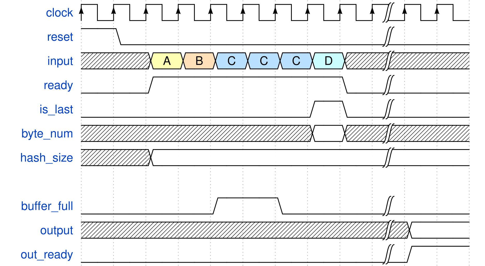

# Keccak Peripheral

This is the code for the peripheral that computes SHA3 hashes. Inside the `src` folder there's code for both  the core itself (`/src/core/`), and for the bus interface (`/src/KetchupPeripheral_v1_0_S00_AXI.v`).

## Core

The core is taken from [OpenCores](https://opencores.org/projects/sha3). Two main changes have been made to it:
- It now supports all four main lenghts of SHA3: 224, 256, 384, 512.
- It now outputs hashes that are compliant with FIPS 202; so the hases are proper SHA3, as compared  to the Keccak hashes of the original core. 

The timings for this core are identical to the original one, except that there's an additional `out_size` input signal which controls what kind of hash the core should output. This input should be steady for the whole duration of the hashing process, otherwise the peripheral output is undefined. Valid values for `out_size` are:
- `00`: The output hash is SHA3-512;
- `01`: The output hash is SHA3-384;
- `10`: The output hash is SHA3-256;
- `11`: The output hash is SHA3-224.

## Timings

In order to start an hash procedure, you first have to reset the peripheral to put it in a known state. After that, you can feed data to the core by raising the `ready` signal high and putting the data in the `input` signal. If the core raises the `buffer_full` signal, then `input` and `ready` must stay still until `buffer_full` goes low. You can only give data to the core in increments of four bytes. At the end of the converison, you must raise the `is_last` signal high for the last clock cycle. There, you have to put the amount of bytes that you're giving to the core inside the `byte_num` signal, which is otherwise ignored before. This number is from `0` to `3`: this means that if your original input data is already a multiple of four you still need to give an empty input at the end, to signal end of conversion. After a while, the core will raise the `out_ready` signal, and while that signal is high, the value of the `output` register is valid. Note that the most significant `n` bits of `output` are ever valid, where `n` is the size selected from `hash_size`.

The hash size is set through the `hash_size` (Called `out_size` in the core) signal, which has to be steady from when you feed it the first four bytes of data until you stop reading the output.

## Testbench

Running the testbench requires a modern version of python, [Icarus Verilog](https://github.com/steveicarus/iverilog) and probably some way to visualize the resulting waveforms (Like [gtkwave](https://gtkwave.sourceforge.net/)). All the tests can be run by simply running the `make` command, and it will test all possible combinations of inputs. If you want to add more test cases, you can edit the `test_strings` array inside `maketests.py`.
