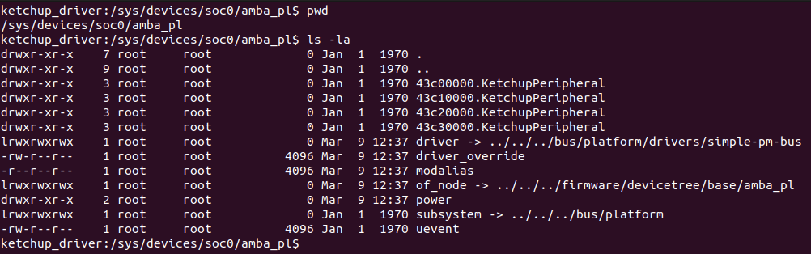
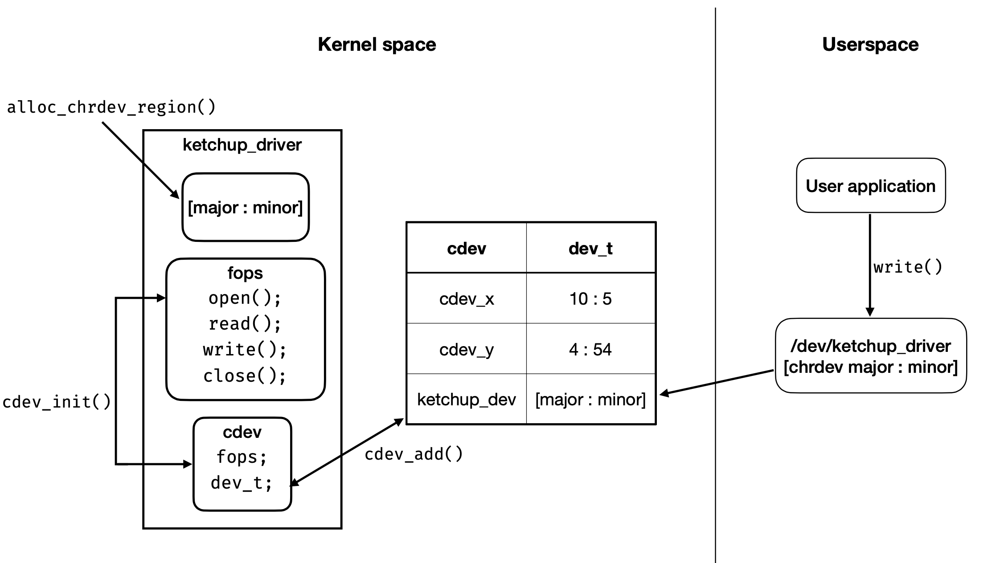
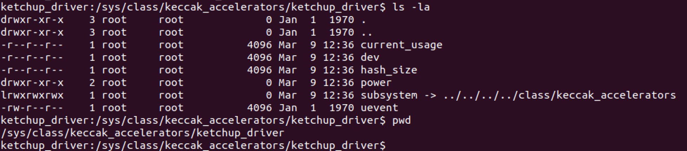

# Ketchup_driver

For our keccak peripheral we implemented a **character driver** that manages write and read operation from and to the custom logic block.

Since the peripheral is contained into the FPGA part of the Pynq-Z2 board, we implemented it as a **platform device driver** (so it doesn't support discoverability).

## Peripherals setup

> This is a brief overview. For detailed information on the hardware's inner workings, please refer to the dedicated folders for each peripheral.

Inside the Pynq-Z2 board we managed to fit 4 completely identical keccak-peripherals.

As shown in the device tree file, all peripherals are integrated into the device tree structure under the _amba-pl_ node.

```sh
amba_pl: amba_pl {
		#address-cells = <1>;
		#size-cells = <1>;
		compatible = "simple-bus";
		ranges ;
		KetchupPeripheral_0: KetchupPeripheral@43c00000 {
			clock-names = "s00_axi_aclk";
			clocks = <&clkc 15>;
			compatible = "xlnx,KetchupPeripheral-1.0";
			reg = <0x43c00000 0x10000>;
			xlnx,s00-axi-addr-width = <0x7>;
			xlnx,s00-axi-data-width = <0x20>;
		};
		KetchupPeripheral_1: KetchupPeripheral@43c10000 {
			clock-names = "s00_axi_aclk";
			clocks = <&clkc 15>;
			compatible = "xlnx,KetchupPeripheral-1.0";
			reg = <0x43c10000 0x10000>;
			xlnx,s00-axi-addr-width = <0x7>;
			xlnx,s00-axi-data-width = <0x20>;
		};
		KetchupPeripheral_2: KetchupPeripheral@43c20000 {
			clock-names = "s00_axi_aclk";
			clocks = <&clkc 15>;
			compatible = "xlnx,KetchupPeripheral-1.0";
			reg = <0x43c20000 0x10000>;
			xlnx,s00-axi-addr-width = <0x7>;
			xlnx,s00-axi-data-width = <0x20>;
		};
		KetchupPeripheral_3: KetchupPeripheral@43c30000 {
			clock-names = "s00_axi_aclk";
			clocks = <&clkc 15>;
			compatible = "xlnx,KetchupPeripheral-1.0";
			reg = <0x43c30000 0x10000>;
			xlnx,s00-axi-addr-width = <0x7>;
			xlnx,s00-axi-data-width = <0x20>;
		};
	};
```

The same structure is reflected in the _sysfs_ file system: all the peripherals are located under the _amba_pl_ node as can be seen in the following screenshot.



In terms of the driver, the steps required for successful communication with the peripheral differ depending on the operation requested. There are two cases to consider:

- a **write** operation
- a **read** operation

### Write operation

When a user application in user space intends to write data to our peripheral, it simply needs to open the device file `/dev/ketchup_driver` and write the data.

At a high level, when the device file is opened, the peripheral is initialized with the appropriate hash size requested by the user. Then, the data that the user wants to send to the peripheral is copied into the kernel space using the `copy_from_user()` function, and then sent to the input register of the peripheral in 4-byte chunks using an internal buffer.

The peripheral remains "idle" until an additional write is performed on the same file descriptor.

### Read operation

When a user process wants to read from the peripheral, there must be an already open file descriptor for the `/dev/ketchup_driver` file.

During the read attempt, the driver transmits a "last input" command to the peripheral, as well as any remaining data from the internal buffer (if available). If no data remains in the buffer, whatever was left on the buffer is transmitted. This is not an issue since, when writing to the peripheral's input register, we have to specify the length of the last input, which can be zero.

Upon sending the last input, we await the completion of the hashing operation by polling the peripheral's status register until it reads 1. This polling is capped at maximum 100 iterations to keep the peripheral from locking up the entire system in case of faults (For example, if you try to use this when booting from QEMU with FPGA simulation disabled); note that the polling always takes much fewer cycles than 100.

As soon as the result is available, we read it from the 15 output registers. The number of registers we read from depends on the hash that has been computed.

## Interfacing with the OS

The way our driver interfaces with the OS can be summarized with this diagram



When a user application writes to the device file, the operating system (OS) identifies the associated driver for that specific device file by using the major and minor numbers of that file. Subsequently, the OS can invoke the specific functions we have defined for our device.

In the diagram, we have also indicated the various system calls, or _syscalls_, provided by the Linux kernel that we utilized to register our driver with the OS.

A small glimpse of the class we created for our accelerator and the various attributes we are exposing with _sysfs_, refer to the following screenshot



## Driver inner workings

As explained before, we have 4 identical but completely separated peripherals inside the programmable logic part.
When a "hash requested" is initialized with a specific keccak peripheral, the operation must be concluded before starting a new one, otherwise the behaviour is undefined.

For this reason, we had to ensure that once a peripheral is opened by a process (i.e., when a file descriptor is opened), there must be an "assignment process" of a specific peripheral to the specific file descriptor. Furthermore, until the file descriptor is closed, no other file descriptor should be assigned to the same peripheral.

To solve this problem, we internally used an array of devices within the driver, where each device represents a specific physical peripheral. The relevant code is provided below:

```C
struct ketchup_devices_container {
	// Used to protect the registered_devices array
	struct mutex array_write_lock;

	// Used to make sure that only registered_devices_len
	// processes at a time can access a peripheral
	struct semaphore dev_free_sema;

	struct ketchup_device *registered_devices[MAX_DEVICES];
	size_t registered_devices_len;
};
```


Inside the `registered_devices` array, we maintain the state of all four peripherals at our disposal.

To address the issue of matching a file descriptor to a specific peripheral, we were fortunate. Upon examining the Linux kernel source, we discovered a field named `private_data` inside the `file` struct. By utilizing this field, we can save the index (in the array containing all the different peripherals) of the peripheral assigned to the file descriptor.

```c
/* needed for tty driver, and maybe others */
	void			*private_data;
```

The code responsible for the "match" between a file descriptor and a peripheral can be seen below.

```c
static int ketchup_open(struct inode *inod, struct file *fil)
{
	/**
	 * When a new file descriptor is opened we need to search for an available
	 * peripheral that can serve the request.
	 * If all the peripherals are already assigned, we return -EAGAIN
	*/
	int should_block = (fil->f_flags & O_NONBLOCK) == 0;

	int assigned_peripheral = peripheral_acquire(should_block);

	if (assigned_peripheral < 0) {
		return assigned_peripheral;
	}

	// Save index for read and write
	fil->private_data = (void*)(uintptr_t)assigned_peripheral;

	return 0;
}
```

Inside the `peripheral_acquire` function before proceeding with the assignment, we first of all acquire a lock in order to guarantee the uniqueness of the match.

## Userspace

For what concerns userspace, the driver exposes a few things:

- the device file (`/dev/ketchup_driver`)
- the `current_usage` attribute inside `sys/class/keccak_accelerators/ketchup_driver`
- the `hash_size`attribute inside `sys/class/keccak_accelerators/ketchup_driver`

### Sysfs attributes

By executing `cat current_usage` from within `sys/class/keccak_accelerators/ketchup_driver`, the user can quickly see which peripherals are currently being used and if so by which process.

Similarly, by executing `cat hash_size` also from `sys/class/keccak_accelerators/ketchup_driver`, the user can observe the hash size currently configured for each peripheral.

### Ioctl

As briefly explained in a previous paragraph, each peripheral has a configurable hash size (512, 384, 256, 224). The way we configure each peripheral is through the usage of _ioctl_.
Inside the driver we defined two ioctl input operations,

```c
#define WR_PERIPH_HASH_SIZE _IOW(0xFC, 1, uint32_t*)
#define RD_PERIPH_HASH_SIZE _IOR(0xFC, 2, uint32_t*)
```

one for reading and one for writing a new value inside the peripheral.
Obivously setting a different hash size is a device-specific operation that differs from regular file operation semantics (like `read` and `write`), this is the reason we used ioctl.

### User library

Interacting directly with all these different parameters would be a bit cumbersome. For these reason we also developed a custom library that serves as a "wrapper" to all that's been presented up until now.

A user that wants to use our peripheral can simply call one of the following functions that differ from one another only by the dimension of the output (as can be deducted from the function name).

```c
kc_error kc_sha3_512(void const *data, uint32_t data_length, uint8_t *digest, uint32_t *digest_length)
kc_error kc_sha3_384(void const *data, uint32_t data_length, uint8_t *digest, uint32_t *digest_length)
kc_error kc_sha3_256(void const *data, uint32_t data_length, uint8_t *digest, uint32_t *digest_length)
kc_error kc_sha3_224(void const *data, uint32_t data_length, uint8_t *digest, uint32_t *digest_length)
```

## Building the project

To reduce the size of the repository, the content of the ketchup_driver folder is the result of the ```petalinux-build -x mrproper``` command that cleans all the artifacts produced by the build process.
For this reason, the following steps are necessary to obtain an executable image:

1. Copy the ```ketchup-driver``` folder to a location on your computer (it's recommended to avoid working directly inside the repository as different file paths could disrupt the build process).
2. Navigate into the newly created folder and execute the following commands in this order without making any changes in the configuration menus: ```petalinux-config -c kernel```, ```petalinux-config -c u-boot```, ```petalinux-config -c rootfs```.
3. Once the previous steps have been completed, run ```petalinux-build``` from the same folder.
4. For packaging the image, refer to the 'petalinux-workflow' guide located in the Tutorials folder.
