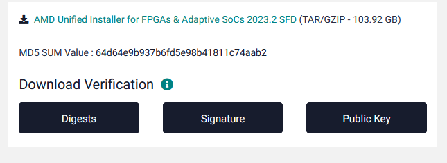
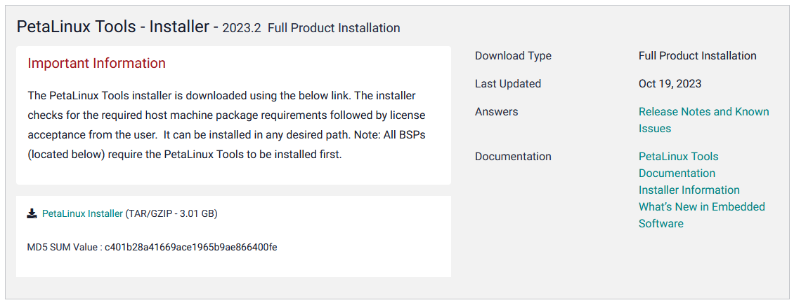

# OSES project setup

Inside this markdown document I'll try to collect as many information as possible for what concerns the installation part.

## Intro

Basically what we have to do for this project comes down to:

- Generating an `.xsa` file from a Vivado design, which describes a custom IP that will go inside the FPGA
- Building a linux image around it with the Petalinux tool
- Booting that image onto the PynqZ2 board (or in qemu if you don't have the board)
- Developing a driver for the IP running inside the FPGA

A small note I'd like to make is that this whole process will require a lot of free space, upwards of 300 GB, so keep that in mind while you follow this guide if you don't have much free space in your hard disk/SSD.

## Installation

You'll need the following:

- A machine with Ubuntu running on it (either physical or virtual)
- Vitis, Vivado and Petalinux installed on that machine

Can you install different versions of the one I'm suggesting? Of course but the interface will be different than the one that Carpegna shows in the tutorial and all the menu's will be different, I think that's an overhead but if you'd like to install the newer versions go for it, Pietro did it and he's not having any problem (except spending a little bit more time tinkering around)

### Ubuntu

For what concerns Ubuntu, you have various options. I have tested the **22.04.3 LTS**.
It's the only one possible? No. But it's a good compromise, the newer versions are not even supported by all the tools so picking a recent version but not the latest one should do the trick.

### Vitis, Vivado and Petalinux

The only mandatory tool between Vitis and Vivado is Vivado. This means that in principle you could get away with only installing Vivado, but it's not recommended since you never know what you'll need during development (like some specific drivers that are installed only with one of the two programs).
I have installed the **2023.2** version of both the programs. The download page is found [here](https://www.xilinx.com/support/download/index.html/content/xilinx/en/downloadNav/vivado-design-tools/2022-2.html). It is suggested to use the offline installer for Vitis (Which will include Vivado as well), which, even though it's a massive `103.92 GB` file download, will be much easier to install.



Again for Petalinux I've installed the **2023.2** version. Be careful that the Petalinux tools need to be of the **same version of Vitis and Vivado**. So if you install the 2023.1 or 2022.2 version of Vitis and Vivado you'll also must download the same version number of petalinux. One thing to note about Petalinux is that it depends on bash, so if you're using a system with another shell (like `zsh` or `fish`) you have to change back to bash, even if only while you're using Petalinux.

You can find a complete step by step guide for the installation [here](https://www.hackster.io/whitney-knitter/vivado-vitis-petalinux-2023-1-install-on-ubuntu-22-04-ab28da). Be sure to follow it after downloading the Vitis installer, but before actually running it.
The guide is for the 2023.1 version but you can use it also for the 2023.2, just pay attention to the version numbers when you are downloading.

For convenience's sake I will include a quick summary of that guide without many explanations, just in case anyone ever needs to do this process more than once and they're interested only in performing all the steps.

#### Installing system dependencies

Enable 32-bit binaries in the system:
```bash
sudo dpkg --add-architecture i386
```

Run these commands in this order to install all needed dependencies:
```bash
sudo apt-get install iproute2 make libncurses5-dev tftpd libselinux1 wget diffstat chrpath socat tar unzip gzip tofrodos
sudo apt-get install debianutils iputils-ping libegl1-mesa libsdl1.2-dev pylint python3 python2 cpio tftpd gnupg zlib1g:i386 haveged perl
sudo apt-get install lib32stdc++6 libgtk2.0-0:i386 libfontconfig1:i386 libx11-6:i386 libxext6:i386 libxrender1:i386 libsm6:i386
sudo apt-get install xinetd gawk gcc net-tools ncurses-dev openssl libssl-dev flex bison xterm autoconf libtool texinfo zlib1g-dev cpp-11 patch diffutils
sudo apt-get install gcc-multilib build-essential automake screen putty pax g++ python3-pip xz-utils python3-git python3-jinja2 python3-pexpect
sudo apt-get install liberror-perl mtd-utils xtrans-dev libxcb-randr0-dev libxcb-xtest0-dev libxcb-xinerama0-dev libxcb-shape0-dev libxcb-xkb-dev
sudo apt-get install openssh-server util-linux sysvinit-utils google-perftools
sudo apt-get install libncurses5 libncurses5-dev libncursesw5-dev libncurses5:i386 libtinfo5
sudo apt-get install libstdc++6:i386 libgtk2.0-0:i386 dpkg-dev:i386
sudo apt-get install ocl-icd-libopencl1 opencl-headers ocl-icd-opencl-dev
```

#### Installing Vitis and Vivado

Run the Vitis installer (with super user privileges). Make sure to install it inside the `/tools/Xilinx` folder, since many other and tools rely on that.

After having done that, run these commands:
```bash
cd /tools/Xilinx/Vitis/2023.2/scripts/
sudo ./installLibs.sh
cd /tools/Xilinx/Vivado/2023.2/data/xicom/cable_drivers/lin64/install_script/install_drivers
sudo ./install_drivers
```

Now in order to have Vivado and Vitis available everywhere, you should add these commands to your `.bashrc`:
```bash
source /tools/Xilinx/Vivado/2023.2/settings64.sh
source /tools/Xilinx/Vitis/2023.2/settings64.sh
```
This will add the relevant folders to the PATH environment variable, so you can call `vitis` and `vivado` from the command line.

#### Installing Petalinux

Run these commands to create the folders for the Petalinux install, since it doesn't create them by itself. Note that you have to substitute `<user>` with your username:
```bash
sudo mkdir -p /tools/Xilinx/PetaLinux/2023.2/
sudo chmod -R 755 /tools/Xilinx/PetaLinux/2023.2/
sudo chown -R <user>:<user> /tools/Xilinx/PetaLinux/2023.2/
```

Then download the installer from [the official PetaLinux Page](https://www.xilinx.com/support/download/index.html/content/xilinx/en/downloadNav/embedded-design-tools.html)


You will need to extract it, give it the appropriate permissions and then run it:
```bash
sudo chmod 777 ./petalinux-v2023.2-10121855-installer.run
./petalinux-v2023.2-10121855-installer.run --dir /tools/Xilinx/PetaLinux/2023.2/
```

Agree to the licenses, and then the installation is done. Now to run it you will need to source a specific file, which does give some info when you run it. So I recommend this time to ad an alias inside your `.bashrc`, something along the lines of:
```bash
alias petalinux='source /tools/Xilinx/PetaLinux/2023.2/settings.sh'
```

Now whenever you want to use petalinux, just remember to run the `petalinux` command.

To see if everything is working, you can run the command:
```bash
petalinux-util --help
```

## After the installation

After you followed the guide the fun part begins.
I would suggest you to follow the tutorial made by Carpegna on the students portal to build confidence with the various tools.
Once you arrive to the Vitis part you can stop actively following, it's not important anymore if you don't have the board, maybe just try to understand what he's doing to better understand the various pieces at play.

After you have the tools and understood what we have to do you can start from the [official Xilinx documentation for PetaLinux](https://docs.xilinx.com/r/en-US/ug1144-petalinux-tools-reference-guide) (just be sure you are looking at the right version). In the documentation there's all the important information you need to use the Petalinux tool efficiently.

After that you can explore all the contents in the Tutorials folder where I'll try to keep updated all the files. If you want to modify something feel free to open a pull request.
