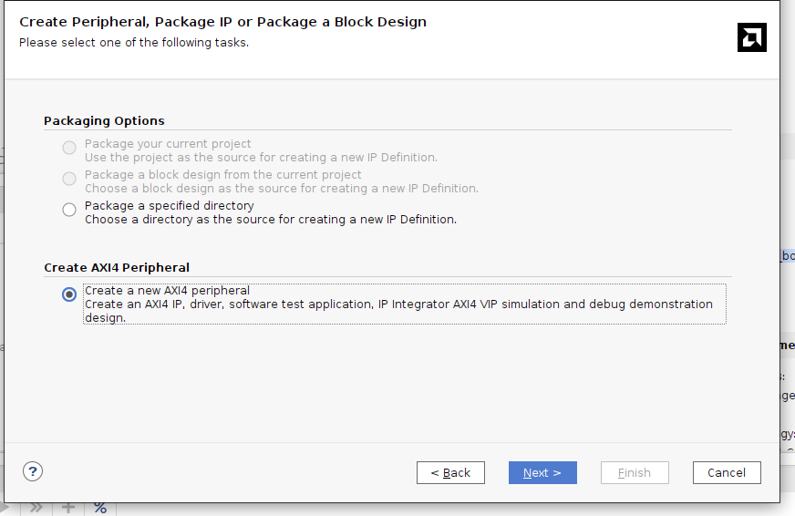

# Vivado Workflow

This is a guide on making Vivado work. The ultimate end goal of this step is to create an `.xsa` file, which contains all the information needed for Vitis and PetaLinux to program the FPGA with the custom IP and to run programs on the Pynq. Here is the documentation for the official docs of `.xsa` files: [XSA](https://docs.xilinx.com/r/en-US/ug1400-vitis-embedded/XSA).

One thing I'm assuming is that you have all the `.vhdl` files needed to make the core work. If you are trying to write hardware, I'd suggest make sure that works first using the simulations tools you already know how to use, and only then follow this guide. For this tutorial, I'm going to use the example adder given by Carpegna. The source for the adder can be found [here](./ExampleCore/adder.vhdl).

Also, this guide is based on the video tutorial made by Alessio Carpegna, which you can find in the course material under the _Projects_ folder.

## Creating the Project

The first thing to do is to create a project using Vivado. Give it whatever name you want, but make sure to choose "RTL Project" in the appropriate window.

Then, on the parts window, choose the "Boards" tab, and then first hit the "Refresh Button" (If this is your first time doing this, otherwise Vivado won't have an option for the Pynq board by default). After doing that, you can search for the Pynq Z2 board, download it and then select it.

So, once you have created your project, the first step is to add a new IP. You can do this by going to `Tools > Create and Package New IP`.

Then you have to choose `Create a new AXI4 peripheral`:

In the next two menus you don't really have to change anything (Except maybe for the IP name). If you want, here you can enable interrupt support. In the end, make sure to click on `Edit IP` in order to open a new project window with the new IP.

## Add your Core to the project

You can now add the hardware core in the project. You can do it by right clicking on "Design Sources" and clicking on `Add Sources`:

Now you need to actually connect the component to the relevant registers. The file you'll want to modify is `<project-name>_v1_0_S00-AXI.vhd`. First, add your core interface as a component of that entity. Add also any output signal you might need here:

Then, you will need to instantiate the component at the end of the architecture implementation:

Now, the only thing left to do to connect everything properly is to send the output of the adder to `slv_reg3`:

After all of this is done, you can go to the `Package IP` tab. Go to `File Groups`, and click on `Merge changes from File Groups Wizard`. Then under `Review and Package`, you can click on `Re-Package IP`, and agree to close the project. You have now created the required IP.

## Getting the XSA file

Having done that, the last step needed is to create a block design, by clicking on `Create Block Design`, under `IP INTEGRATOR` on the left.

In the new window that appears, press the plus button and add the `ZYNQ7 Processing System` component:

Then click on `Run Block Automation`. This will auto-generate some standard blocks to configure your component properly. After that, click on the plus button again, and add your component. You have to press on `Run Connection Automation` here. This will create a more complex interconnection, putting together everything the system needs to run automatically.

Now you just need to convert this design into VHDL code. And to do that you just have to right click on the design, and then `Create HDL Wrapper`:

Now everything is done. You just need to click on `Generate Bitstream`, and wait for the compiler to do its thing for a while. After everything gets compiled, you can export the `.xsa` file by clicking on `File > Export > Export Hardware`.

**Absolutely make sure to include the bitstream**, otherwise you will have to recompile it every time. Once you have the `.xsa` file, this part is done, and you won't need Vivado anymore:

## Looking at the address

One thing you may want is to see where the compiler decided to put the address for the peripheral registers. To view it, you can go to the `Address Editor` tab, and potentially even change it:

