# Vivado Workflow

Before starting, a couple notes:
- This tutorial was made for the _Vitis Unified IDE 2023.2_. This is a new version of the Vitis IDE, which is now based on VS Code instead of Eclipse. While this means that the actual IDE is way better (Since Eclipse is notoriously terrible), do note that there is very little documentation online for this specific version of the editor; so expect to tinker around a bit before getting everything working;
- This tutorial assumes that you have already generated an `.xsa` file somehow. I will use `axi4_cpu_interface_wrapper.xsa`, which you can find inside the `ExampleCore` folder, which implements the simple adder shown in the Vivado Workflow tutorial;
- For the final project, Vitis is not required. However, it's the easiest way to boot the Pynq in bare metal configuration that I've found so far, so it's pretty useful for testing if the peripheral does what you expect without having to actually write a full Linux driver;
- Since both the Linux driver and the application can be both written without using Vitis at all, this tutorial will skip anything Linux related.

## Project Setup

The first thing to do in a Vitis project is to create a new Workspace. This can be done by clicking on `Open Workspace`. Feel free to choose whatever folder you like, as long as it's empty.

After doing that, the first thing to do is to create the platform. To do that, go to `File > New Component > Platform`:

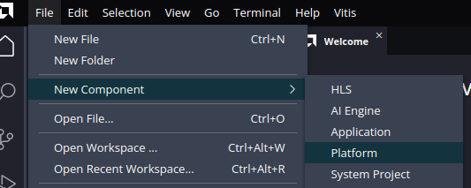

This will create a dialog window. Give the platform a name, and then click on `Next`. In the following page, you have to provide the `.xsa` file. Click on hardware design, and then select the `.xsa` file after clicking on `Browse`.

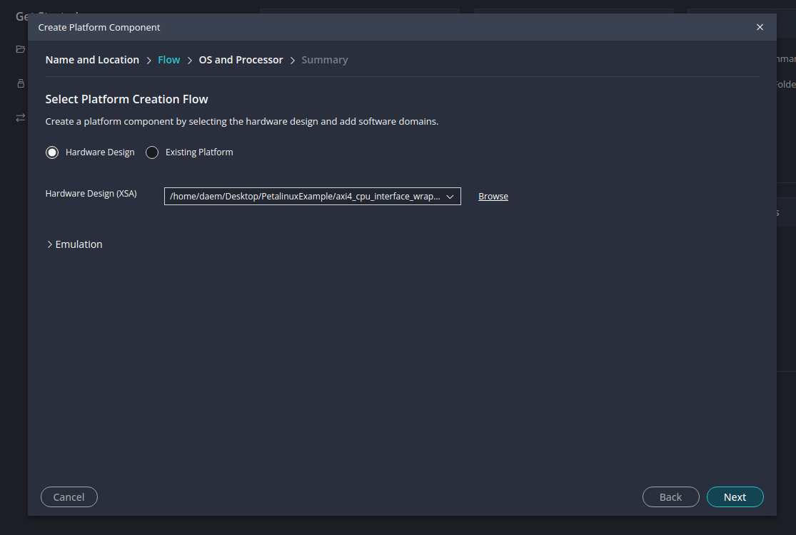

After that, you have to choose `standalone` as the OS, and then `ps7_cortexa9_0` as the CPU:

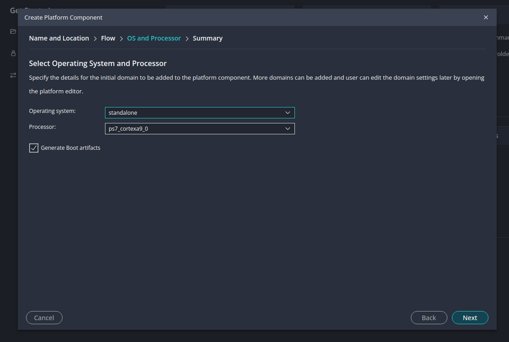

You can hit next, and then eventually finish after this step. Now, one important thing to do before creating a new project is clicking on the platform you've just created, and then clicking `Build` on the bottom left. If you don't do this, the BSP will not be generated and you will have problems later:

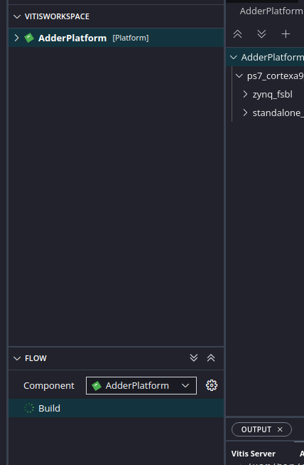

After the IDE is done building the platform (A green checkmark will appear), we can create our project. Just go to `File > New Component > From Examples`, and then choose `Hello World` under `Embedded Software Examples`. Click on the plus, and then follow the wizard, selecting the platform you've just created and leaving everything else as default (Except for maybe the name):

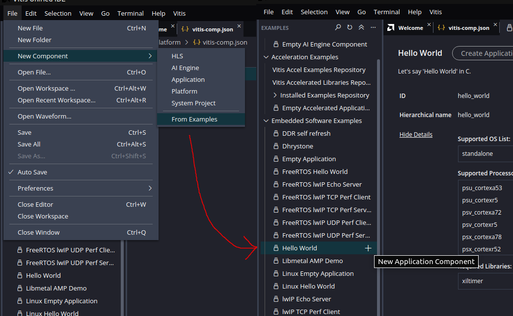

## Running the Project

Now that you've built the project, open it and go look at the default files it created. It will have created some `.c` source files under `Sources > src > helloworld.c`:

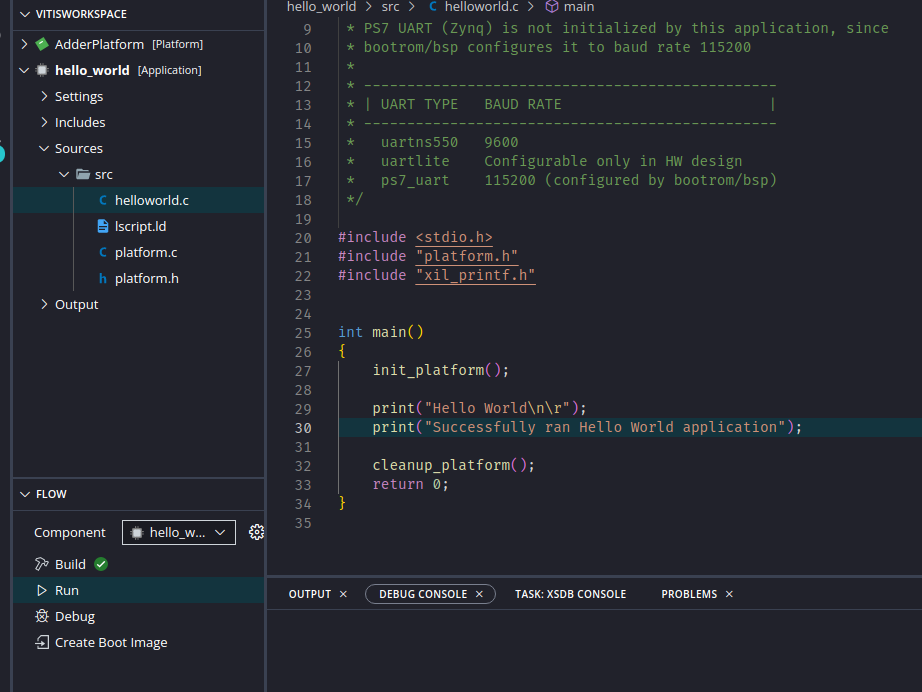

You now need to connect the Pynq to your pc (If the jumper is set on USB power mode you will only need the USB cable).
If you try to build and run this project, you will (hopefully) notice that nothing happens, even if the project seems to be flashed correctly to the Pynq (i.e. the green DONE led turns on). This is because, contrary to previous Vitis versions, the new unified IDE does not include a serial window for whatever reason. In order to see anything you will first need to connect a serial terminal to the board. You can use whatever you like. A common choice is puTTY, i prefer [GTKTerm](https://www.acmesystems.it/gtkterm) instead since it doesn't close automatically if you turn off the Pynq. If you configure it to the correct port (it was `/dev/ttyUSB1` for me, but it can be different. Try doing `ls /dev/` and try every `ttyUSBx`), and then UART 115200 8N1:

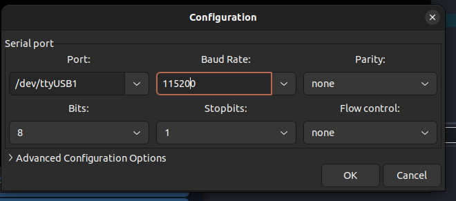

If you now build again, and run the project again **while the terminal is still connected to the serial port**, you should see the Hello World message:

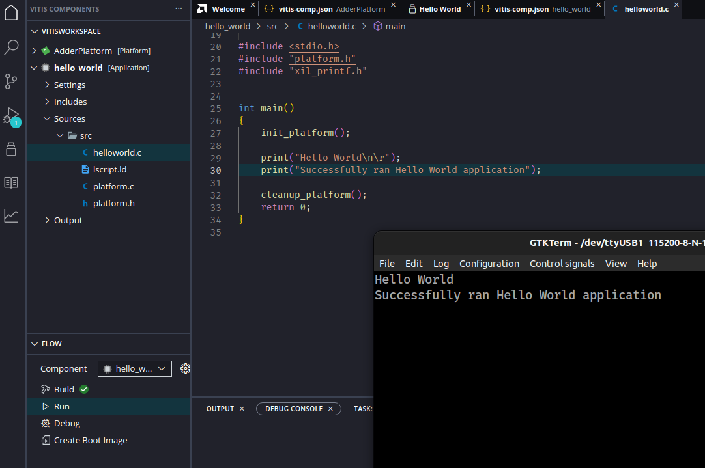

## Using your custom hardware

While building the project has generated some headers for using the custom hardware that you built, they won't be automatically added to your project.

One simple solution to this project is to ignore those headers completely and just access the physical memory locations manually, since you can get their address by looking at Vivado:

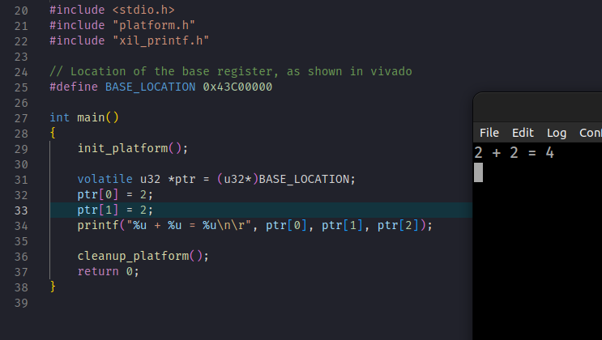

The same base address can be found by including the `xparameters.h` header file. For me, it was called `XPAR_AXI4_ADDER_0_BASEADDR`. If it's different for you, you have to search it inside the header:

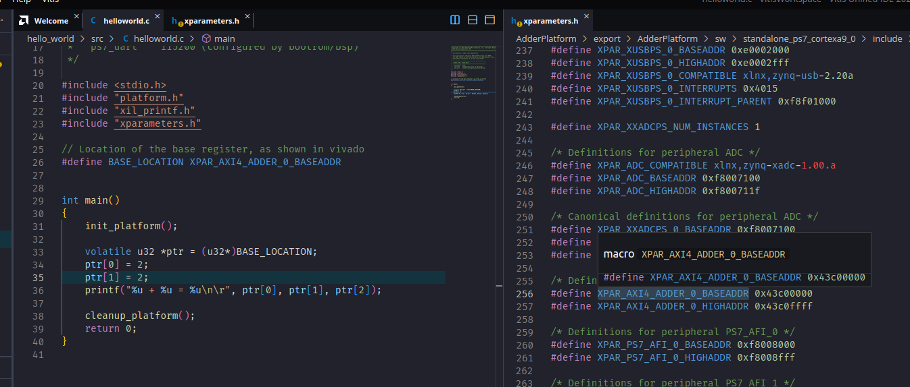

Now, I'm sure that there is a clean way to include the headers you need to the project, but I've still yet to find it. The best alternative I've found is to copy-paste the relevant headers into your project directly. The header you need is found inside `Adder Platform > Sources > hw > sdt > drivers > <project_name>_v1_0 > src > <project_name>.h`. That is the file you need to copy over your project:

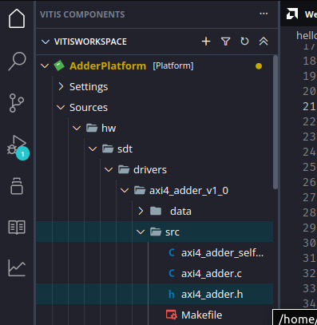

Now you can use the functions defined there. Note that you will need to include the `xil_io.h` header file as well for the `Xil_Out32` and `Xil_In32` functions:

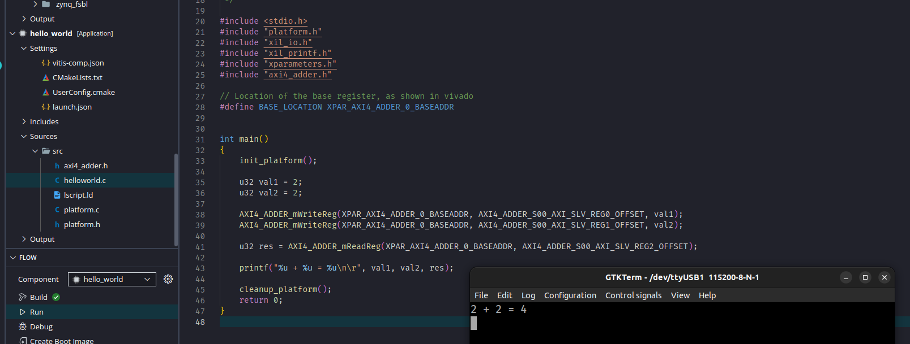
