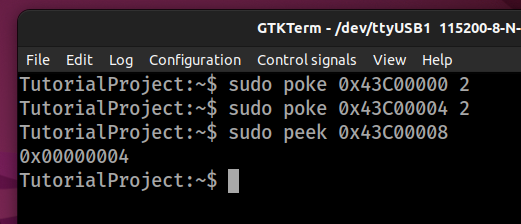
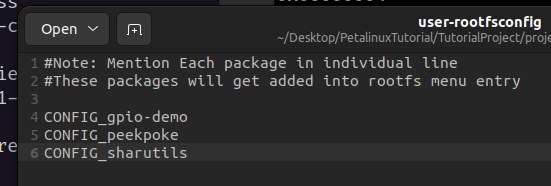
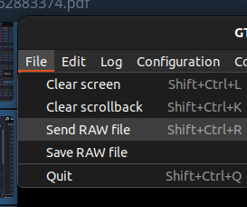

# Petalinux default workflow

> I'm assuming that once you are here you already have a ```.xsa``` file on hard

The objective of this note is to recap the default workflow that leads to obtaining a Linux image that can be flashed onto an sd card or booted inside qemu.

All the things written here follow the [official xilinx documentation](https://docs.xilinx.com/r/2022.2-English/ug1144-petalinux-tools-reference-guide/Overview) and [this video](https://www.youtube.com/watch?v=OfozFBfvWeY)

Do note that everything having to do with PetaLinux is incredibly slow, so don't panic if a command takes way too long to run.

Also note that all `petalinux-config` commands are mandatory, even if you don't want to change anything.

## Project creation

First of all you need to create a petalinux project. Choose a folder where you would like to create a project and launch

```sh
petalinux-create --type project --template zynq --name <NAME>
```

## Getting the hw description

Once the folder is created you need to include the ```.xsa``` file created by Vivado. Move inside the newly created project folder and launch

```sh
petalinux-config --get-hw-description=<PATH_AT_XSA_FILE>
```

After a little while a window should open where you can tweak some parameters of your hardware. One thing i suggest to remove is tftpboot. To do that, hover over `Image Packaging Configuration > Copy final images to tftpboot` and then press `n` to disable. Then you can exit twice, and the config will run.

## Project configurations

Once the project is created and the hardware included, you still need to configure few additional things.
Let's start with the kernel. Always inside your project folder, launch

```sh
petalinux-config -c kernel
```

Like in the previous example thi command will open a window where you can tweak different kernel parameters.
After you save and the process completed, we can move on to the next step.

Always from the same folder, launch:

```sh
petalinux-config -c u-boot
```

In the window that opens do the configurations you wish. If you want to enable booting from SD, enable `Boot options > Boot media > Support for booting SD/EMMC`.

When you are over launch:

```sh
petalinux-config -c rootfs
```

This is the final configuration, from here you can decide which packages to include in your final image. Some packages i'd recommend to include are:
- `Filesystem Packages > admin > sudo > sudo`
- `user packages > peekpoke`

Remember that the more packages you decide to include the bigger your image will be (and also you'll have longer build times).

## PetaLinux build

After all of this configurations you are ready to build. Simply launch

```sh
petalinux-build
```

This will take a while depending from your laptop (On real hardware i measured 10m29s, I'd image that running on a VM massively slows it). If while you are building you experience some red errors don't worry, probably the build will fail but you can simply start again once has failed and the second time it should complete without problems (in like 20 seconds so no more hours waiting).

## Running on JTAG

If you just want to make sure everything is working, you can boot Linux from JTAG. Connect the board to USB, open some serial terminal and connect it with UART 8N1 with baud rate 115200; then, run this command:
```bash
petalinux-boot --jtag --kernel
```
This will flash the OS onto the board via JTAG, which is going to be pretty slow but won't require anything having to do with the SD card. Note that if you already programmed the board with anything you'll need to manually reset it first, by pressing one of the two reset buttons.

Note that the default username is `petalinux`, and you will have to define a password each time. I always choose `root` for test examples.

If you have enabled the `user packages > peekpoke` package, you can try to see if your hardware works:



## Copying files to the Pynq

This is a kinda hacky way I found to move files from your PC to the Pynq board. There are surely better ways to do this, but this way does work.

First of all, go to the file `<project-folder>/project-spec/meta-user/conf/user-rootfsconfig`. In this file, add the line `CONFIG_sharutils`.



Now you can run `petalinux-config -c rootfs`, and enable sharutils under `user packages > sharutils`. Now you can `petalinux-build` and reboot the system.

You also need to install this library on your pc; under Ubuntu this can be done with `sudo apt install sharutils`.

At this point, you have everything needed. Whenever you need to send a file to the Pynq, you can:
```bash
uuencode <file-name> <file-target-name> > <file-name>.enc
```

Then, in your serial terminal of choice, you can run `cat > tmp`, and then send the contents of `<file-name>.enc` via the terminal. Once you're done, hit `CTRL+D` on your keyboard, and use `uudecode tmp` to decode the file. You now have the file in the target machine.

If you use GTKTerm, you can use `File > Send RAW file` to send the file after writing `cat > tmp`:



## Compiling an application for the Pynq without Petalinux

This can be done quite easily. Whenever you source `petalinux`, you also source the required compilers for the system. The one you should use is `arm-linux-gnueabihf-gcc`, and you can use it as a normal gcc version. So, to compile a file, you can run:
```bash
arm-linux-gneabihf-gcc <input-file> -o <output-file>
```

Then send the resulting output file to the board using your preferred method.

## Creating a Kernel Module (Driver)

To create a custom kernel module, run this command for the root of the project:
```bash
petalinux-create -t modules --name <module-name> --enable
```

This will create a new module, and its source will be placed under the `<project-root-dir>/project-spec/meta-user/recipes-modules/<module-name>` folder. Note that the tool for whatever reason doesn't like underscores (`_`) in the name of modules, so don't use them. Also sometimes the tool will complain about uppercase letters in the name, so avoid those as well.

Now if you want to modify the module, go inside its source folder and change the code according to what you need to do. When you want to compile, inside the project run the command:
```bash
petalinux-build -c <module-name>
```

Note that this can take some time: on my laptop it's around 1 minute ~ 1 minute 30 seconds, so writing the module is going to be pretty slow.

The output of this command is stored inside:
```
<project-root>/build/tmp/sysroots-components/zynq_generic_7z020/<module-name>/lib/modules/6.1.30-xilinx-v2023.2/extra/<module-name>.ko
```

You can now take this file, upload it to your board and then insert it there. You can insert the module using:
```bash
sudo insmod ./<module-name>.ko
```

And you can remove it with:
```bash
sudo rmmod <module-name>
```

One suggestion is to not retrieve the module by hand each time from the folder, but to make a script to automate that. For example, one such script could be:
```bash
mkdir -p ./module_target/
cd ./module_target/
rm -f ./*
cp ../build/tmp/sysroots-components/zynq_generic_7z020/ledmodule/lib/modules/6.1.30-xilinx-v2023.2/extra/ledmodule.ko ./
uuencode ./ledmodule.ko ledmodule.ko > ledmodule.enc
```

## Creating an application that will be present inside the rootfs

With the command `petalinux-create -t apps --template c++ --name hello.c` a simple project will be created inside components/apps/, than we'll only need to enter the rootfs configuration (`petalinux-config -c rootfs`) and enable our program. At this point we need to rebuild petalinux (`petalinux-build`) and we can boot with our application already inside the file system.

## Booting from an SD Card

TODO

## Aftermath

This is basically all there's to it. Now you can reference to the official documentation linked at the beginning of this document to explore what can be done next.
